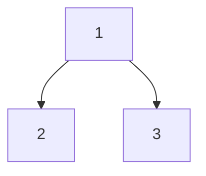
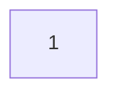
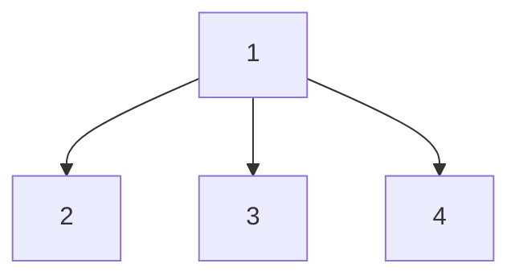

# STRIPS_Graph


## For Coding
* Python 3.9.6
* Packages:
    * matplotlib 3.7.2
    * networkx 3.1


## Definition of Graph
A **directed graph** of **digraph** is a graph in which edges have orientations with a pair $G=(V,E)$ comprising:  
* $V$, a set of vertices(also called nodes or points)  
* *E*, a set of edges(alse called directed edges,directed links and so on)  

$$
E\subseteq\{(x,y)|(x,y)\in V^{2}\,\,\text{and}\,\,x\ne y\}
$$

In this project, the nodes represent the conditions(also called status) and the edges represent the actions.   

To make it more clear, I will give an example to explain this.  

```yaml=
STRIPS:
    Initial Condition:
        hunger: true
        have an apple: true
        have a watermelon: true
    Goal: 
        hunger: false
    
    Action:
    - eat an apple:
        precondition:
        
        hunger: true
        have an apple: true
        postcondition:
        
        hunger: false
        have an apple: false
        
    - eat a watermelon:
        precondition:
        
        hunger: true
        have a watermelon: true
        
        postcondition:
        
        hunger: false
        have a watermelon: false
        
```

In the above example, The NPCs have two options. One is eating an apple and another is eating a watermelon. Therefore, the graph from the example data should looks like this:  


- $Node_{1}$:represent the initial condition:
```yaml=
hunger: true
have an apple: true
have a watermelon: true
```
- $Node_{2}$:represent the condition after the NPCs eating an apple:
```yaml=
hunger: false
have an apple: false
have a watermelon: true
```
- $Node_{3}$:represent the condition after the NPCs eating a watermelon:
```yaml=
hunger: false
have an apple: true
have a watermelon: false
```

Of course, we will know that:
- $Edge_{(1,2)}$:represent the action so-called eat an apple.
- $Edge_{(1,3)}$:represent the action so-called eat a watermelon.

## How to convert from the STRIPS to Graph


### Initialzation

In order to make the process of converting be logicl and without losing any information, Firstly, the Whole graph would contain only single node named node_{1}.  

**Waring: :warning:   
perhaps it should be called node_{0}, but because in my coding, i name it as node_{1}, it a little bit hard to fix it, Please forgive with this small mistake.** :smile: 

Now, in our graph, it should look like this:

### More nodes could be generated

Considering every time the NPCs do one action, the conditions of this guy could be changed by action at the same time. So Let's consider the action before adding nodes to our graph.

We observe that the there are some actions whose precondition is satisfied by the initial node($node_{1}$).i.e. ***buff_friend_attack*** & ***buff_friend_defense*** & ***buff_friend_speed***  

Naturally, our graph is updating like this:


- $Node_{2}$:represent the condition after the NPCs buff_friend_attack
- $Node_{3}$:represent the condition after the NPCs buff_friend_defense
- $Node_{4}$:represent the condition after the NPCs buff_friend_speed
- $Edge_{(1,2)}$:represent the action so-called buff_friend_attack
- $Edge_{(1,3)}$:represent the action so-called buff_friend_defense
- $Edge_{(1,4)}$:represent the action so-called buff_friend_speed

### Traverse to complete the graph

Every time we add some new nodes to our graph, we always check if there are some actions that could be done by NPCs according to the new nodes.

Finally, we could generate the whole graph! :sunglasses: 


